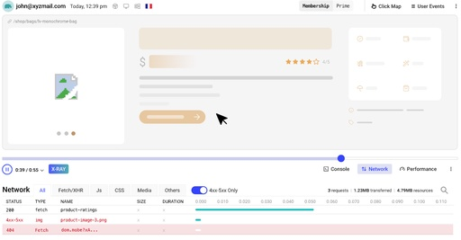

#周刊 #今日分享周刊 #Go #Go周刊

> 今日分享 Go 周刊 #001：Screego - 开源的屏幕共享服务器；OpenReplay - 屏幕录制、会话重放工具；FlyScrape - 网络爬虫工具；OAuth2 - OAuth 2.0 的 Go 客户端实现；Gops - 查看所有 Go 进程的命令行工具

## 🛠 开源前线

### Screego - 开源的屏幕共享服务器

一款开源的屏幕共享工具，专为开发人员设计，用于安全地与同事或客户共享他们的屏幕。它利用 WebRTC 技术建立点对点连接，实现低延迟和高分辨率的实时屏幕共享。

> GitHub: https://github.com/screego/server

### OpenReplay - 屏幕录制、会话重放工具

一款开源的会话重播和分析工，可用于复现问题，查看用户行为，提升用户体验；相比于 rrweb / timecat 只有前端，而 OpenReplay 是一个完整的产品，包括前端和后端；支持私有部署。

> GitHub: https://github.com/openreplay/openreplay

### FlyScrape - 网络爬虫工具

一个使用 Go 语言开发的独立且可脚本化的网络爬虫工具，它将 Go 语言的速度与 JavaScript 的灵活性相结合，让你可以更专注于数据提取。

> GitHub：https://github.com/philippta/flyscrape

### OAuth2 - OAuth 2.0 的 Go 客户端实现

一个 Go 实现的 Oauth2 客户端，支持哆啦A梦、微信、飞书、GitHub、Google、GitLab、Slack、Kakao 等，支持 Zoox、Gin、Fiber 等 Go Web 框架。

> GitHub: https://github.com/go-zoox/oauth2

### Gops - 查看所有 Go 进程的命令行工具

一个用于查看系统中所有 Go 写的进程的命令行工具，出自 Google。

> GitHub：https://github.com/google/gops

## 📘 技术文章

- 无

## 👨‍👩‍👧‍👦  一起成长
进入分享群，每日分享新技术、新资讯，每天 1 分钟，帮助你强制学习，1 年就算 365 个知识点，助你早日成为大神，财务自由。

添加我，备注「今日分享 - Go」
