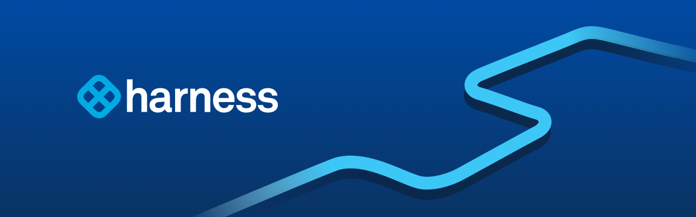

#周刊 #今日分享周刊 #Go #Go周刊

> 今日分享 Go 周刊 #002：AnyLink - 企业级远程办公 ssl vpn 软件；Digger - 一个开源的 IaC 编排工具；Gitness - 开源的 GitOps 开发者平台；亲爹也可能靠不住！Google将来会对Go团队说ByeBye吗？

## 🛠 开源前线

### Hatchet - 分布式、容错的任务队列

一款分布式、容错的任务队列，旨在简化在多个服务器或容器上运行任务的过程

GitHub：https://github.com/hatchet-dev/hatchet

### Expr - 一种以 Go 为中心的表达式语言

它旨在以无与伦比的准确性、安全性和速度提供动态配置。 Expr将简单的语法与强大的功能相结合。

GitHub：https://github.com/expr-lang/expr

### GCopy - 开源跨设备剪切板同步工具

使用 Golang 和 Nextjs 开发。
GCopy 可以在 PC、Mac 和移动端之间共享剪切板。它支持文字，截图和文件。对网络没有太高的要求，不同的设备可以在同一个局域网，也可以不在。

GitHub：https://github.com/llaoj/gcopy

### AnyLink - 企业级远程办公 ssl vpn 软件

可以支持多人同时在线使用。基于 openconnect 协议开发，并且借鉴了 ocserv 的开发思路，可以完全兼容 AnyConnect 客户端。

GitHub：https://github.com/bjdgyc/anylink

### Digger - 一个开源的 IaC 编排工具

它允许你在现有的 CI 流水线管道中运行 IaC。Digger 的优势在于，它可以在你的 CI 中原生运行 terraform，这样做既安全，因为云访问密钥不会与第三方共享，又经济，因为你不需要为运行 terraform 支付额外的计算费用。

GitHub：https://github.com/diggerhq/digger

### Gitness - 开源的 GitOps 开发者平台

Gitness 是一个开源的 GitOps 开发者平台，它集成了代码管理、持续集成和持续交付 (CI/CD) 的功能，帮助开发者更轻松地管理代码、构建和部署应用程序。Gitness 使用 Go 和 Node.js 构建，用户可以本地安装或在 Docker 容器中运行它。

GitHub: https://github.com/harness/gitness

## 📘 技术文章

### Go新提案：返回值应该明确使用或忽略？

之前在写 Go 代码时 IDE 经常会提示。外加我有一个朋友他团队内 CodeReview 也会遇到一些方法的返回值，处理不处理的问题。一开始大家还会讨论一下，久而久之基本也就麻木了。

文章：https://mp.weixin.qq.com/s/E3t4pzr-OH02Du7eNXS7hQ

### 亲爹也可能靠不住！Google将来会对Go团队说ByeBye吗？

近期Google有两个事件引发了开发者的关注！
一个是谷歌解雇了内部参与 Python基金会工作的团队，谷歌 Python 工程师、CPython 核心开发者兼 Python 指导委员会成员Thomas Wouters在社交媒体发布动态称：包括自己在内的同事、主管均已被裁员。
另一个是Google的flutter团队被进一步裁员了！
这也引发了Go社区对Go团队的担心，并发起了“如果Google决定放弃核心 Go 团队，这对其未来意味着什么？”的讨论！

文章：https://mp.weixin.qq.com/s/oGAsuHeuh7U9I6m3TChvSA

### Traefik Proxy V3.0 正式版发布：支持 WebAssembly 和 Kubernetes Gateway API

文章：https://mp.weixin.qq.com/s/j-35ZN8GRNKKE4D1qhFzpw

### 探索 Go 的 Fan-Out/Fan-In 模式：让并发更 easy

并发在 Go 中可以是提高程序性能和效率的强大工具。然而，有效管理 goroutine 和 channel 有时可能会有挑战，特别是在复杂的情况下。这就是扇出/扇入模式发挥作用的地方，它使得在 Go 中进行并发更加容易和可维护。

文章：https://mp.weixin.qq.com/s/-c_Rvg7qyiQEfVIHAao6Jg

## 👨‍👩‍👧‍👦  一起成长
进入分享群，每日分享新技术、新资讯，每天 1 分钟，帮助你强制学习，1 年就算 365 个知识点，助你早日成为大神，财务自由。

添加我，备注「今日分享 - Go」
