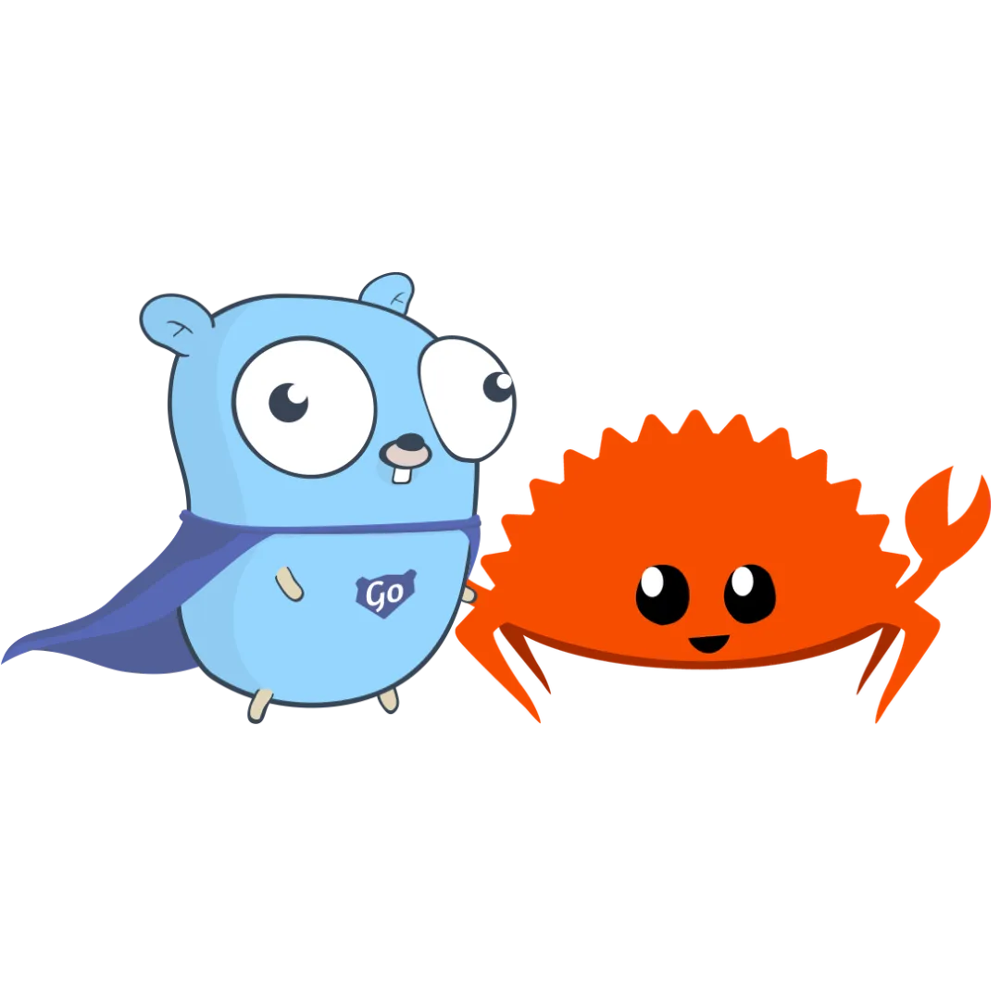

#周刊 #今日分享周刊 #Go #Go周刊

> 今日分享 Go 周刊 #003：Go 易错点 100 例；Go 与 Rust：未来的软件开发大比拼；Nunu - 一个基于 Go/Gin 的应用脚手架；Gost - 一个用 GO 语言实现的安全隧道；Gotenberg - 基于 Docker 的无状态 PDF 创建服务；Crawlab - 一款开源、强悍的分布式爬虫管理平台

## 🛠 开源前线

### Nunu - 一个基于 Go/Gin 的应用脚手架

它的名字来自于英雄联盟中的游戏角色，一个骑在雪怪肩膀上的小男孩。和努努一样，该项目也是站在巨人的肩膀上，它是由Golang生态中各种非常流行的库整合而成的，它们的组合可以帮助你快速构建一个高效、可靠的应用程序。

GitHub: https://github.com/go-nunu/nunu

### Gost - 一个用 GO 语言实现的安全隧道

它具有多端口监听、可设置转发代理、支持多种隧道类型、SNI 代理等功能。

GitHub: https://github.com/ginuerzh/gost

### Gotenberg - 基于 Docker 的无状态 PDF 创建服务

只需要一个接口服务，你就可以将任何文件或者连接转换为 PDF。

GitHub: https://github.com/gotenberg/gotenberg

### Crawlab - 一款开源、强悍的分布式爬虫管理平台

基于 Golang 的分布式爬虫管理平台，支持 Python、NodeJS、Go、Java、PHP 等多种编程语言以及多种爬虫框架。

GitHub: https://github.com/crawlab-team/crawlab

### Gohalt - 一个通用的限流（Throttle）库

你可以把它用在流水线（pipeline）、限流（rate limiter）等场景，同时它已经支持 Go 1.22 了。

GitHub：https://github.com/1pkg/gohalt

### v8go - Execute JavaScript from Go

Go 实现的 JavaScript 引擎，底层基于 Google Chrome v8 内核执行 JavaScript。

GitHub: https://github.com/tommie/v8go

### Melody - 打造实时应用的 WebSocket 框架

Melody 是基于 github.com/gorilla/websocket 的WebSocket框架，它提供非常精简而又具备强大功能的接口。Melody框架的核心理念是为了让你的Websockets处理更加简单和高效，从而可以让开发者更专注于应用的业务逻辑。

GitHub: github.com/olahol/melody

## 📘 技术文章

### Go 易错点 100 例

https://www.topgoer.cn/docs/go_Language_100/go_Language_100-1fg3t2qiuvkka

### Go 与 Rust：未来的软件开发大比拼

Go 语言和 Rust 语言作为现代编程语言，在软件开发领域有着广泛的应用和不小的影响力。它们各自的特点、优势和适用场景各异，也各自拥有一批忠实的拥护者。本文将详细探讨这两种语言的设计哲学、性能特点、使用场景以及未来发展趋势。

https://mp.weixin.qq.com/s/Kbn7rgvgIqjILqg8X3W_iA

## 👨‍👩‍👧‍👦  一起成长
进入分享群，每日分享新技术、新资讯，每天 1 分钟，帮助你强制学习，1 年就算 365 个知识点，助你早日成为大神，财务自由。

关注微信公众号，添加我，备注「今日分享 - Go」

